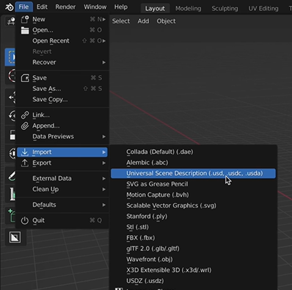
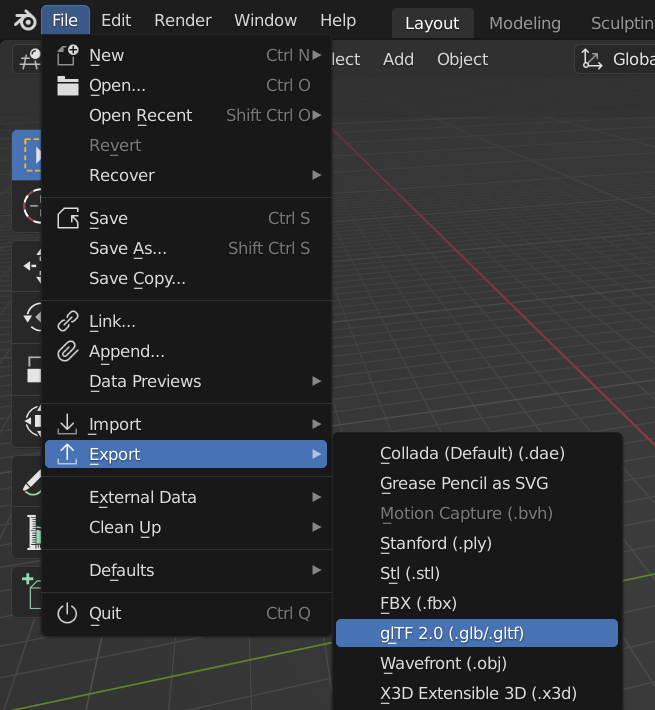
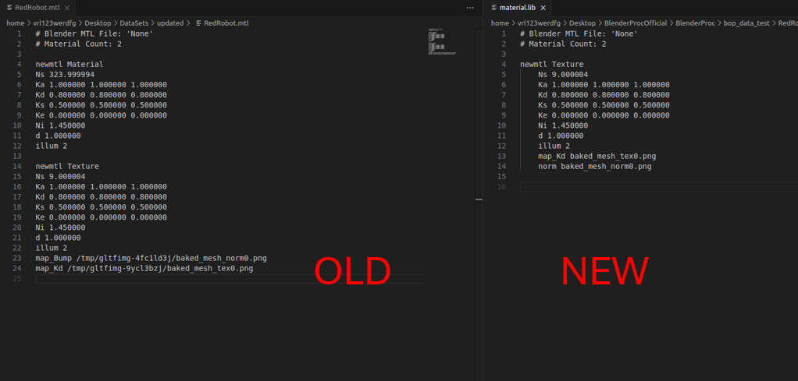
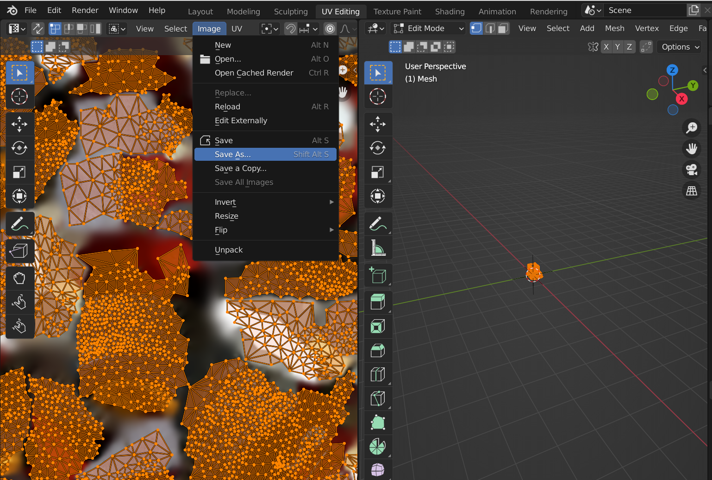
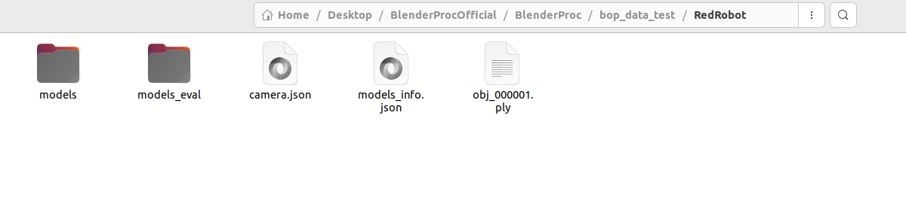
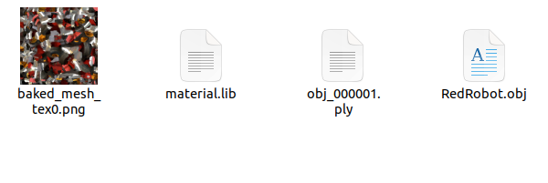
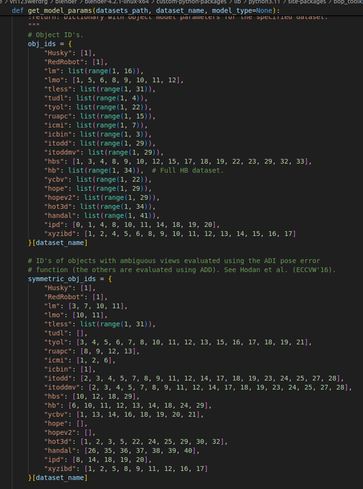
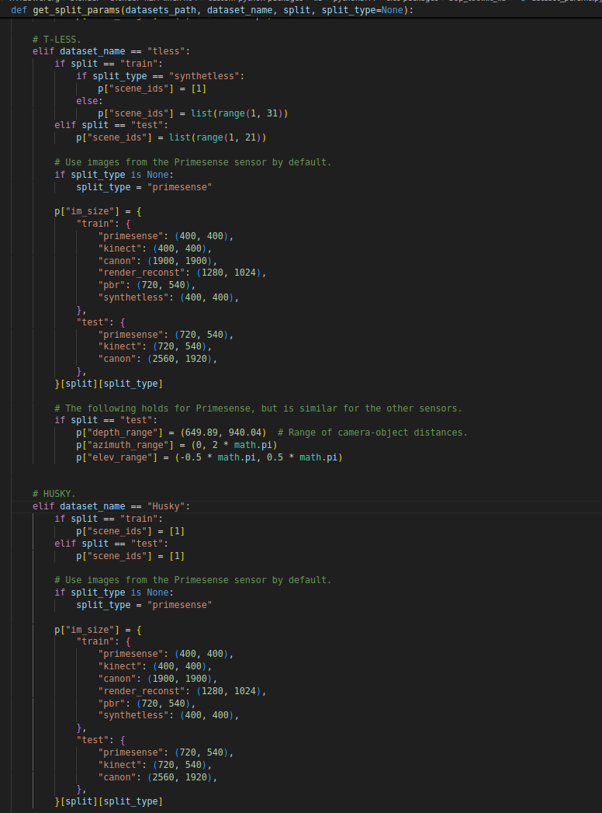

# Dataset-Generation-Guide-using-BlenderProc

This guide provides step-by-step instructions for generating a dataset using **Blender** and **BlenderProc**. The process involves scanning an object, converting it to a suitable format, installing necessary tools, and running the dataset generation pipeline.

## Part I – File Preparation

### Step 1: Scan Object of Interest Using RealityComposer
- Use **RealityComposer** to scan the object you want to create a dataset for. Follow the necessary steps in RealityComposer to capture your object.

### Step 2: Extract `.usdz` File and Transfer to PC
- After scanning the object, extract the `.usdz` file and transfer it to your PC for further processing.

### Step 3: Download Latest Version of Blender
- Visit [Blender’s official website](https://www.blender.org/download/) to download the latest version of **Blender**.

### Step 4: Import `.usdz` into Blender
- Open **Blender**.
- Go to `File -> Import -> Universal Scene Description (.usd, .usdc, .usdz)` and select the `.usdz` file you transferred in Step 2.



### Step 5: Export the File as `glTF 2.0 (.glb/.gltf)`
- Once the file is loaded in Blender, go to `File -> Export -> glTF 2.0 (.glb/.gltf)` to export the model in the `glTF` format. _(This step is not necessary for generating the dataset)_



### Step 6: Export as Wavefront `.obj`
- Export the model as `.obj` by selecting `File -> Export -> Wavefront (.obj)` _(This will also create a `.mtl` file)_.
- Additionally, export the model as `.ply` by selecting `File -> Export -> Stanford (.ply)`.

### Step 7: Update `.mtl` File
- Open the `.mtl` file and update its file format. Save it with the name `material.lib`.



### Step 8: UV Mapping and Saving Image
- With the `.glb` file open in Blender:
  1. Select the mesh in the scene collection.
  2. Go to the **UV Editing** workspace.
  3. Press `A` to select all faces.
  4. Under **Image**, select `Save As` to save the UV mapping.
  5. Name the image file as `baked_mesh_tex_0.png`.



### Step 9: Prepare Folder in BOP Format
- Create a folder in the **BOP** format. Update the `models_info.json` file to include the dimensions of your object. 
- Refer to the sample folder structure for guidance.

  


---

## Part II – BlenderProc Installation

### Step 1: Install BlenderProc
- Create a new folder on your system.
- Clone the **BlenderProc** repository by running:
   ```bash
   git clone https://github.com/DLR-RM/BlenderProc.git
   cd BlenderProc
   pip install -e .


### Step 2: Go to BOP_challenge
- Run:
   ```bash
   cd examples/datasets/bop_challenge

### Step 3: Download the CC textures (requires good internet):
- Run:
   ```bash
   blenderproc download cc_textures 

---

## Part III – BlenderProc Installation

### Step 1: Edit model parameters

- Open `/home/vrl123werdfg/blender/blender-4.2.1-linux-x64/custom-python-packages/lib/python3.11/site-packages/bop_toolkit_lib/dataset_params.py`
- In the function `get_model_params()`, edit the dicts `obj_ids` and `symmetric_obj_ids`, add:
    ```python
    "MyDatasetName": [1],

<br>
<br>



<br><br><br>
- In the function `get_split_params()`, append a new section for your dataset, copying the format of existing splits and adjusting parameters as needed.



<br><br><br>


### Step 2: Edit the data generation file
- Open or copy the husky.py file provided in the repo and edit the parameters to fit your dataset.
- Add this file to the BlenderProc repo
- Open or copy the run.sh file provided in the repo and edit the parameters.
- Add this file to the BlenderProc repo

### Step 3: Edit the data generation file
- Open terminal in the location where you saved the run.sh
- Run:
   ```bash
   chmod +x run.sh
   ./run.sh
- Your dataset will start generating and you will be ready in the output directory


### Step 4: Fine-Tuning & Optimization
- Inspect generated images and annotations in the output folder.
- Adjust parameters in husky.py (e.g., number of views, lighting setups).
- For more details check the python files in `BlenderProc/examples/datasets/bop_challenge/` 

